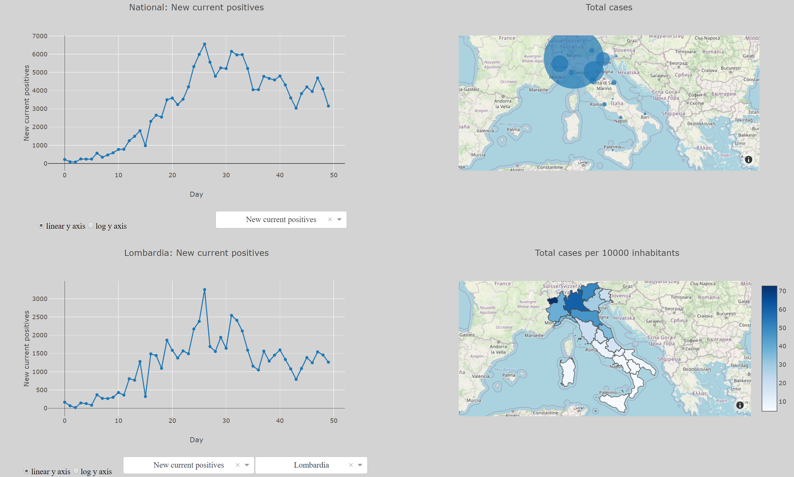

# Italy-Covid19-Dashboard (desktop only)

Dashboard to visualise the data made available by the Italian Italian Civil Protection Department on the Covid-19 outbreak in real time.

## Disclaimer
The dashboard worked fine when I have tested it and provides a good deal of interactivity when exploring the data. In fairness, I find it more useful than [the official one from the Italian Civil Protection Department](http://opendatadpc.maps.arcgis.com/apps/opsdashboard/index.html#/b0c68bce2cce478eaac82fe38d4138b1).  However I cannot guarantee that the code (and thus the dashboard) is 100% error-free.

I find the name of the variables self-explanatory; however, the definition of each variable, in both Italian and English, can be found [here](https://github.com/pcm-dpc/COVID-19/blob/master/README.md).

I strove to follow useful guidelines and recommendations from different sources (mainly [Ten Considerations Before You Create Another Chart About COVID-19]([https://medium.com/nightingale/ten-considerations-before-you-create-another-chart-about-covid-19-27d3bd691be8](https://medium.com/nightingale/ten-considerations-before-you-create-another-chart-about-covid-19-27d3bd691be8)) and [Is that COVID-19 data dashboard doing good? Or is it actually worse than nothing?](https://towardsdatascience.com/is-that-covid-19-data-dashboard-doing-good-or-is-it-actually-worse-than-nothing-de43da1c98be)) for developing a dashboard about such a sensitive topic in a proper and conscientious way. 

However, I am a scientist and and engineer and I mostly use Python (... and coding in general!) to do calculations and some data viz! Hence, *my knowledge of CSS is almost non-existent - and you can definitely tell that from my code!* . So there is room for improvement (to put it mildly) in terms of the appearance of the dashboard and **any improvements/suggestions with respect to this or any other aspect are more than welcome**. 

I am using [Open Street Map](https://www.openstreetmap.org) for the plots requiring a map. If you have a [Mapbox](https://www.mapbox.com/) token you can use it to replace Open Street Map by:
1. Insert your Mapbox token in the commented line `token = 'insert_mapbox_token_here'` and uncomment the line
2. Comment the line `mapbox_style="open-street-map"` in the two functions that are generating the map plots
3. Uncomment the line `accesstoken=token` in the two functions that are generating the map plots

## Resources
* Data is taken from [the official repository of the Italian Civil Protection Department](https://github.com/pcm-dpc/COVID-19). The data is updated every day around 5pm by the Italian Civil Protection Department. The dashboard checks for new data and updates itself automatically every 24 hours.

* Geojson file for Italian regions taken from: https://github.com/Dataninja/geo-shapes/tree/master/italy

* Data on the resident population in Italian Regions from: http://dati.istat.it/Index.aspx?DataSetCode=DCIS_POPRES1